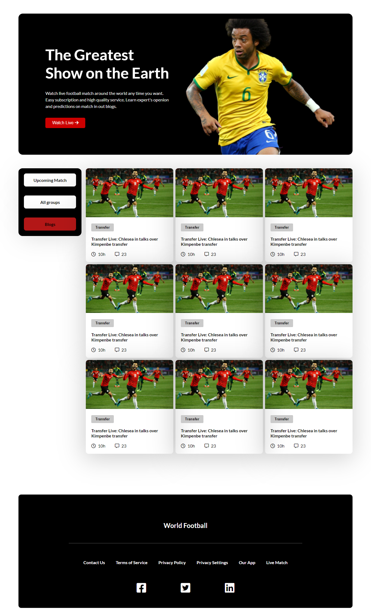

# World-Football

## Table of contents

- [Overview](#overview)
  - [Screenshot](#screenshot)
  - [Links](#links)
- [My process](#my-process)
  - [Built with](#built-with)
- [Author](#author)

## Overview

Practice website on proper implementation of HTML semantic, CSS flexbox and grid and responsive website.

### Screenshot

### Links

- [Live Site URL](https://shamratpg.github.io/World-Football/index.html)

### Built with

- Semantic HTML5 markup
- CSS 5
- Flexbox
- Grid

## Author

- Website - [Md. Shamrat Hossain](https://github.com/shamratPG)
- Twitter - [@shamratpg](https://twitter.com/shamratpg)

